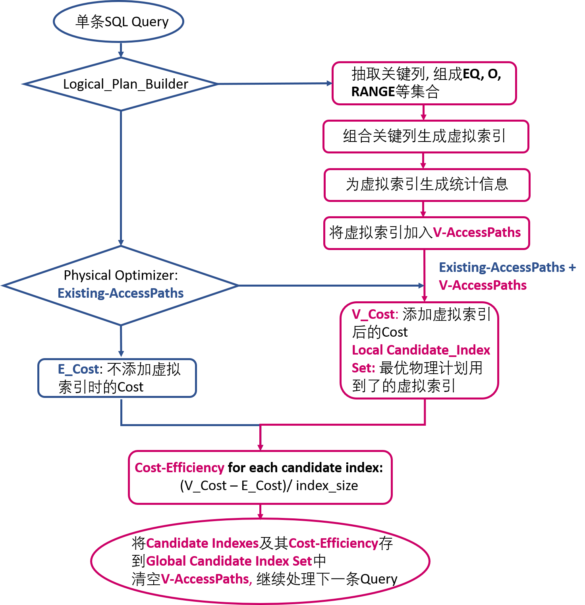

# Proposal: Index Advisor

- Author(s):     [Wang Liang](https://github.com/IggieWang),  [Zou Huan](https://github.com/zouhuan1215)
- Last updated:  July 27, 2019
- Discussion at: #

## Abstract

对特定的SQL Query集，Index Advisor能自动为其推荐合适的索引集合，使用该索引集合，可以总体提升SQL Query集的查询速度。

## Background
索引可以通过以下一种或多种方式加速查询的执行：

- 有序。可以按照索引有序地读取表的内容，这对GROUP BY, ORDER BY, JOIN, DISTINCT等算子是十分友好的。
- 索引可能覆盖了某些查询条件。当索引覆盖了全部查询条件时，可以避免二次读表，如果只是覆盖了部分查询条件，也可以减少读表的行数。

鉴于实际应用中最大可能有数百个表，每个表可能有数十列，而典型的工作集可能有数千个查询，并且索引可能有多列作为键列，而这些列的前后顺序又非常重要，因此可考虑的索引数量是惊人的。

这次提案目的在于向特定SQL Query集推荐合适的索引集合，使得用户在建立这些索引后，能够提高在SQL Query集上的查询效率。

**TODO**: SQL Server, MySQL等数据库的索引推荐方案

## Proposal
Index Advisor生成推荐索引主要包含两个阶段：（1）为单条SQL Query生成推荐索引集；（2）为SQL Query集生成推荐索引集。[Ref: DB2 Advisor: an optimizer smart enough to recommend its own indexes](http://www.cs.cmu.edu/~natassa/courses/15-823/current/papers/0107lohman.pdf)。

### 词汇
- **Existing Index**

原表上已经存在的索引

- **Virtual Index**

只是在Table_Schema中插入而在表上并不存在的“假想"索引 
- **Existing/Virtual_AccessPaths**

根据Existing/Virtual Index获取表内容的方式（Virtual Index在表上并不是真实存在的，故并不能真的通过Virtual Index获取到表的内容) 

- **由SQL Query启发的虚拟索引推荐集**

根据SQL Query将SQL关键词涉及到的列分为以下四种类型：
1. **EQ** 出现在EQUAL关键词上的列
2. **O** 出现在跟顺序有关的关键词上的列，比如GROUP BY, ORDER BY, JOIN, DISTINCT
3. **RANGE** 出现在RANGE关键词上的列
4. **REF** 除上述三种类型，剩下的出现在SQL Query中的列

然后将类型不同的列按下述方式进行组合，可满足组合索引最长左前缀原则：
1. EQ + O
2. EQ + O + RANGE
3. EQ + O + RANGE + REF
4. O + EQ
5. O + EQ + RANGE
6. O + EQ + RANGE + REF

比如对于下面这条SQL Query，其输出的虚拟索引集合为:`{(e,a,b), (e,a,c), (e,a,b,f), (e,a,c,f), (e,a,b,f,d),(e,a,c,f,d), (a,b,e), (a,c,e), (a,b,e,f), (a,c,e,f), (a,b,e,f,d), (a,c,e,f,d)}`
```
SELECT a, e, d 
FROM t 
WHERE e = 10, f < 10 
ORDER BY a,b 
GROUP BY a,c
```

- **Global Candidate Index Set**

存放所有单条索引推荐的虚拟索引的集合

- **Recommend/Remaining Index Set**

Recommend Index Set和Remaning Index Set两者构成了Global Candidate Index Set(GCIS), 其中Recommend Index Set中的索引是GCIS中被选中的为SQL Query集推荐的索引，而Remaining Index Set则是GCIS中没被选中的索引。

### 为单条SQL Query生成推荐索引集

当Index Advisor为SQL Query生成推荐索引集时，Index Advisor应该尝试足够多的可能的索引，但实际上Index Advisor不可能将所有可能的索引都插到原表上，然后执行SQL Query，并比较Query的执行时间。虽然添加某条索引后，Query的执行时间是衡量该索引好坏的最准确最具有说服力的标准，但由于该方案不现实，只能寻找其它指标来衡量虚拟索引的好坏。这次提案用TiDB SQL优化器的Physical Optimizer输出的最优物理计划及其相应的`cost`作为衡量虚拟索引好坏的标准，这么做的动机如下：

1. `cost`是对`execution time`的预估，用`cost`去衡量虚拟索引的好坏是可行且合理的。但需要注意的是，为虚拟索引生成的统计信息会影响预估的效果。
2. 充分利用了TiDB SQL优化器，引入索引推荐功能只需要很少的代码改动。由于虚拟索引只会影响到最优物理计划的选择，故对单条SQL Query而言，在假设所有索引都存在的情况下，可以认为最优物理计划中用到的虚拟索引就是为当前Query的推荐索引。而在Query与Query之间的推荐索引间进行抉择时，可根据各自推荐索引相比原来`reduced_cost`来进行选择。

上述提案在具体实施的时候还需要考虑两个问题：
1. 如果暴力枚举所有可能的索引，则在搜索所有可能的物理执行计划时会遇到路径爆炸的问题。比如对一个有10列的表，单列的推荐索引有`10`种可能，两列的推荐索引有`10 * 9 = 90`种可能，三列的推荐索引有`10 * 9 * 8 = 720`种可能。但暴力枚举出来的推荐索引大部分是没有意义的，相反，我们可以利用SQL Query提供的信息，只去枚举当前Query关心的索引，缩小可能的推荐索引的范围，从而减少物理计划的搜索路径。在将推荐索引划分为单条Query推荐和Query集推荐这两个步骤时，也有防止物理计划搜索路径爆炸的考虑。对于单条SQL Query而言，具体的枚举策略见[由SQL Query启发的虚拟索引推荐集](#)
2. 为组合虚拟索引生成的虚拟统计信息会直接影响最优物理计划的选择，从而影响推荐索引的结果。如何在只有`colA, colB`统计信息的情况下，尽可能准确地估算出组合索引`(colA, colB)`的统计信息，会直接影响到索引推荐的效果。最简单直观的想法是假设`colA`和`colB`统计独立，除此之外，更精确的做法是随机采样一些行，从这些采样行的统计信息中估算`(colA, colB)`的统计信息。

为单条SQL Query生成推荐索引集的流程图如下。
<div align="center">

</div>

### 为SQL Query集生成推荐索引集

当SQL Query集里每条Query都输出了自己想要的索引后，下一步应该从这些索引中选取部分索引形成该SQL Query集的推荐索引集。直观的想法是将`Global_Candidate_Index_Set`里面的索引按照`Cost_Efficiency`降序排列，然后再选取前`N`条作为推荐索引集，但这样做至少有以下两个不合理的地方：
1. `Global_Candidate_Index_Set(GCIS)`里面的每个索引只对其评估了对某条SQL Query的作用，而未评估其对整个SQL Query集的作用。
2. 某条SQL_Query-`Q`可能输出的推荐索引集是{colA, (colB, colC, colD, colE)}，在该索引集存在的情况下，物理计划相比原来减少了`C`，也就是说colA和(colB, colC, colD, colE)的`reduced_cost`都为`C`，但由于colA的size较小，所以colA算下来的`Cost_Efficiency`可能会远远大于组合索引(colB, colC, colD, colE)，最后可能导致colA被选入了SQL Query集的推荐索引集，而(colB, colC, colD, colE)没被选入。但事实上，(colB, colC, colD, colE)索引对Query `Q`的加速作用远大于colA索引。

于是，为了衡量推荐索引集对整个SQL Query集的影响，做了以下改进。大致的想法是随机地从推荐索引集中选取`M`个索引与`GCIS`中剩下的索引构成的索引集交换，然后再评估新的推荐索引集的性能。

```go
sort(GCIS, GCIS.Cost_Efficiency, Descend_Order)
Recommend_Set = GCIS[:N]
Remaining_Set = GCIS[N+1:]
Best_Cost = Evaluate_QueryBatch(QuerySet, Recommend_Set)
for {
    V_Recommend_Set, V_Remaining_Set = SwapElements(Recommend_Set, Remaining_Set, M)
    Variant_Cost = Evaluate_QueryBatch(QuerySet, V_Recommend_Set)
    if Variant_Cost < Best_Cost{
        Best_Cost = Variant_Cost
        Recommend_Set = V_Recommend_Set
        Remaining_Set = V_Remaining_Set 
    }
    ....
    //Swap and Evaluate，直到超时或者运行满一定的轮数,break
}
```

## Rationale

Null
<!--
A discussion of alternate approaches and the trade-offs, advantages, and disadvantages of the specified approach:
- How other systems solve the same issue?
- What other designs have been considered and what are their disadvantages?
- What is the advantage of this design compared with other designs?
- What is the disadvantage of this design?
- What is the impact of not doing this?
-->

## Compatibility

Null
<!--
A discussion of the change with regard to the compatibility issues:
- Does this proposal make TiDB not compatible with the old versions?
- Does this proposal make TiDB more compatible with MySQL?
-->

## Implementation

这次提案采取的方案不需要修改TiDB SQL优化器的源码，只需要添加新的函数并利用好优化器已有的函数。大部分的工作量在Virtual_AccesssPaths的构建上，这部分内容包括：

1. 从Logical Plan中提取SQL Query的关键词和关键列
2. 组合不同类型的关键列生成虚拟索引集合 
3. 为每条虚拟索引生成统计信息

## 功能与测试方案

### 测试方案
评估推荐索引集的优劣可从两个指标去考虑：基础指标--TiDB SQL优化器的Physical Optimizer输出的`cost`和高级指标--Query的执行时间。

- `cost`: 使用推荐索引集后，SQL Query集总的cost应该小于没加索引的cost
- `execution time`: 将推荐的索引都在原表上建立起来以后，SQL Query集总的执行时间应小于没加推荐索引的时间

### 功能实现

> **组合索引**

**基础功能 -- 单列索引推荐。** 向用户推荐单列索引集(比如{colA, colB})，使用该推荐单列索引集后，对相同的SQL Query集和表，在测试方案下表现更优。

**扩展功能 -- 组合索引推荐。** 向用户推荐组合索引集（比如{(colA,colB), colC}），加入该组合索引集后，对相同的SQL Query集和表，在测试方案下表现更优。

> **增删索引**

假设表t共有colA, colB, colC, colD, colE五列，其中colA为主键，{colB, colC}为二级索引。

**基础功能 -- 不考虑已存在的索引的影响。** 基础功能假设当前表t上不存在任何二级索引，只考虑向表t上添加最优的推荐索引集合，不考虑删除表t上已存在的索引({colB, colC})的代价。

**扩展功能 -- 考虑删除已存在的索引的代价。** 如果表t上已存在的二级索引({colB, colC})最后没入选推荐索引集合，那么删除{colB, colC}并新建新的索引是需要一定代价的，所以Index Advisor在评估已存在的索引和虚拟索引的作用时，会更倾向于保留已存在的索引。


## Open issues (if applicable)

Null
<!--
A discussion of issues relating to this proposal for which the author does not know the solution. This section may be omitted if there are none.
-->
